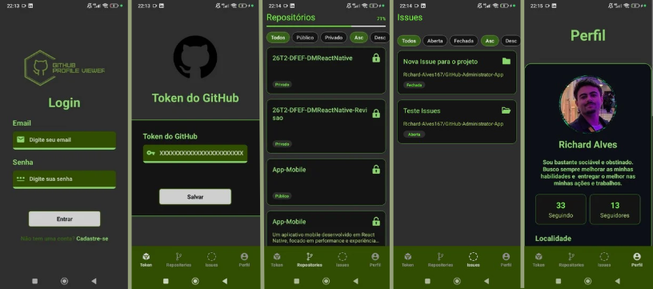

# GitHub Administrator App
 
Aplicação mobile desenvolvida com **React Native + Expo** para visualização e gerenciamento de informações da conta GitHub do usuário. O projeto consome a [API REST oficial do GitHub](https://api.github.com) com autenticação via token pessoal.
 
---
 
## 📋 Sobre o Projeto
 
O app permite que o usuário se cadastre, faça login, informe seu token do GitHub e acesse dados reais da sua conta: perfil, repositórios e issues. A interface conta com navegação em camadas (Stack + Drawer), gerenciamento global de estado via Context API e Reducer, lazy loading com paginação, gestos de swipe, filtros, ordenação e responsividade.
 
---
 
## 🗂️ Estrutura de Diretórios
 
```
src/
├── assets/
│   ├── ColorTypes.js          # Paleta de cores da aplicação
│   ├── images/logo/           # Logos e ícones
│   └── videos/                # Vídeo de splash screen e GIFs
├── components/
│   ├── AlertMessage.jsx
│   ├── ArrowBackPage.jsx
│   ├── CardIssue.jsx          # Card com swipe para abrir/fechar issue
│   ├── CardRepository.jsx     # Card com swipe para ver detalhes do repositório
│   ├── InputField.jsx
│   ├── SubmitButton.jsx
│   ├── ViewLoading.jsx
│   ├── ViewNoGitHubToken.jsx
│   └── ViewWithoutItens.jsx
├── providers/
│   ├── AuthContext.jsx        # Context + Reducer de autenticação
│   └── GitContext.jsx         # Context + Reducer de dados do GitHub
├── Routes/
│   ├── index.js               # Constantes de rotas
│   ├── StackNavigator.jsx     # Navegação de primeiro nível
│   ├── DrawerNavigator.jsx    # Menu lateral com rotas internas
│   └── DashboardNavigator.jsx # Bottom Tabs Navigator
├── screens/
│   ├── SignIn.jsx             # Tela de login
│   ├── SignUp.jsx             # Tela de cadastro
│   ├── User.jsx               # Perfil e token GitHub
│   ├── Home.jsx               # Tela inicial (pós login)
│   ├── Repositories.jsx       # Lista de repositórios
│   ├── Repository.jsx         # Detalhes de um repositório
│   └── Issues.jsx             # Lista de issues
└── services/
    └── githubService.js       # Chamadas à API REST do GitHub
```
 
---
 
## 🚀 Funcionalidades
 
### Autenticação
- Cadastro de usuário (nome, e-mail e senha) com estado gerenciado via Reducer
- Login com validação de credenciais locais
- Logout disponível no menu lateral
### Perfil e Token GitHub
- Tela de perfil onde o usuário informa ou atualiza seu **Personal Access Token** do GitHub
- Após salvar o token, os dados da conta são carregados automaticamente (usuário, repositórios e issues)
### Repositórios
- Lista paginada com **Lazy Loading** — novos itens são buscados ao chegar ao fim da lista
- **Barra de progresso** indicando a porcentagem de repositórios já carregados em relação ao total disponível
- **Filtros** por visibilidade: Todos / Público / Privado
- **Ordenação** alfabética crescente (Asc) ou decrescente (Desc)
- **Swipe para a direita** para navegar até os detalhes do repositório
- **Pull to Refresh** para atualizar a lista
### Issues
- Lista de todas as issues atribuídas ao usuário autenticado (abertas e fechadas)
- **Filtros** por estado: Todos / Aberta / Fechada
- **Ordenação** alfabética crescente ou decrescente
- **Swipe para a esquerda** para **abrir** a issue (`state: open`)
- **Swipe para a direita** para **fechar** a issue (`state: closed`)
- A ação de swipe faz uma chamada PATCH à API do GitHub em tempo real, com rollback automático em caso de erro
- **Pull to Refresh** para atualizar a lista
### Detalhes do Repositório
- Exibe informações detalhadas do repositório selecionado via API
### UX / Interface
- **Splash screen** animada com vídeo personalizado ao iniciar o app
- Indicador visual de carregamento (`ViewLoading`) durante requisições em segundo plano
- Componente `ViewWithoutItens` exibido quando uma lista está vazia
- Componente `ViewNoGitHubToken` exibido quando o token ainda não foi configurado
- Design escuro com paleta de tons de verde (`#71ff39`, `#b3d874`, `#314d01`)
---
 
## 🧭 Navegação
 
```
Stack Navigator (primeiro nível)
├── SignIn          → Tela de autenticação
├── SignUp          → Tela de cadastro
├── Repository      → Detalhes de repositório
└── Drawer Navigator
    ├── User            → Perfil e token GitHub
    ├── Home            → Tela principal
    ├── Repositories    → Lista de repositórios
    └── Issues          → Lista de issues
```
 
---
 
## 🌐 API GitHub utilizada
 
| Método | Endpoint | Descrição |
|--------|----------|-----------|
| `GET` | `/user` | Dados do usuário autenticado |
| `GET` | `/user/repos?page=N&per_page=10` | Repositórios com paginação |
| `GET` | `/issues?filter=assigned&state=all` | Issues atribuídas ao usuário |
| `PATCH` | `/repos/{owner}/{repo}/issues/{number}` | Atualiza o estado de uma issue |
 
Todas as requisições utilizam autenticação via header:
```
Authorization: Bearer {token}
Accept: application/vnd.github+json
```
 
---
 
## 🛠️ Tecnologias e Dependências
 
| Pacote | Versão | Uso |
|--------|--------|-----|
| `expo` | ~54.0.33 | Plataforma base |
| `react-native` | 0.81.5 | Framework mobile |
| `react` | 19.1.0 | Biblioteca UI |
| `@react-navigation/native-stack` | ^7.14.12 | Stack Navigator |
| `@react-navigation/drawer` | ^7.9.9 | Drawer Navigator |
| `@react-navigation/bottom-tabs` | ^7.15.12 | Bottom Tabs Navigator |
| `react-native-gesture-handler` | ~2.28.0 | Gestos de swipe |
| `react-native-reanimated` | ~4.1.1 | Animações |
| `react-native-progress` | ^5.0.1 | Barra de progresso |
| `expo-video` | ~3.0.16 | Splash screen em vídeo |
| `expo-splash-screen` | ~31.0.13 | Controle da splash screen |
| `react-native-safe-area-context` | — | Insets de área segura |
 
---
 
## ⚙️ Como executar
 
### Pré-requisitos
- Node.js instalado
- Expo CLI (`npm install -g expo-cli`)
- Expo Go no dispositivo físico ou emulador configurado
### Passos
 
```bash
# Clone o repositório
git clone <url-do-repositorio>
cd GitHub-Administrator-App
 
# Instale as dependências
npm install
 
# Inicie o projeto
npm start
# ou
npx expo start
```
 
Escaneie o QR code exibido no terminal com o **Expo Go** (Android) ou com a câmera (iOS).
 
### Scripts disponíveis
 
```bash
npm run android   # Inicia no emulador Android
npm run ios       # Inicia no simulador iOS
npm run web       # Inicia no navegador
```
 
---
 
## 🔑 Configuração do Token GitHub
 
1. Acesse [github.com/settings/tokens](https://github.com/settings/tokens)
2. Gere um **Personal Access Token (classic)** com os escopos: `repo`, `read:user`, `user:email`
3. No app, faça login e navegue até a tela **Usuário**
4. Cole o token no campo indicado e salve
---
 
## 🏗️ Arquitetura de Estado
 
O app utiliza **Context API + useReducer** em dois contextos independentes:
 
**`AuthContext`** — gerencia autenticação local:
- `set_user` — define o usuário logado
- `set_registeredUser` — armazena o usuário cadastrado
**`GitContext`** — gerencia dados do GitHub:
- `set_token` — armazena o token da sessão
- `set_usuario_github` — dados do perfil GitHub
- `set_repositorios` — lista de repositórios (acumula páginas ou reinicia na página 1)
- `set_issues` — lista de issues
- `update_issue_status` — atualização otimista do estado de uma issue
- `update_issue` — confirmação da atualização após resposta da API (ou rollback em caso de erro)
---